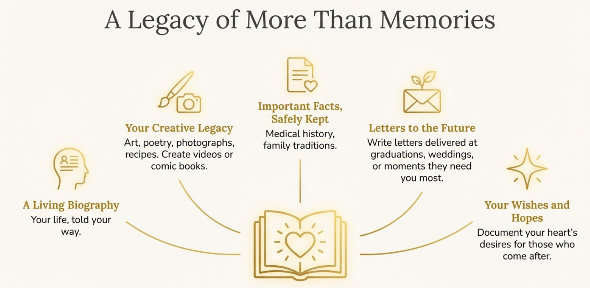

# Keep Their Stories Alive

<strong>A gentle way to preserve the ones you love</strong>

---

## Remember Grandma's Kitchen?

The way she'd tell stories while kneading bread, her hands moving with practiced grace? The wisdom she'd share over tea, the laughter that crinkled the corners of her eyes? What if those moments didn't have to fade?

What if your children—and their children—could still hear her voice, learn from her experiences, and feel the warmth of her presence?

---

## Your Story, Beautifully Preserved

**Ancestors AI** helps you create something precious: a living memory of the people you love. It's as simple as it is profound, starting with the stories you're already telling and transforming them into something your family will treasure forever.

### It Begins With a Simple Blog

Think of it as writing letters to the future. Using a comfortable WordPress blog, you share memories just as you would in an email to a friend. A photo from the garden. A story about childhood summers. The recipe that's been passed down for generations.

Nothing complicated. Nothing technical. Just you, sharing your life in your own words.

### Then Something Magical Happens

Your stories become a conversation. Through the gentle assistance of AI, those blog posts transform into an interactive memory keeper—a chatbot that lets your loved ones ask questions, explore memories, and discover the stories they never knew to ask about.

*"Grandma, tell me about when you were young."*  
*"What was your wedding day like?"*  
*"What advice would you give me about starting a family?"*

The answers come from your own words, your own experiences, thoughtfully woven together to feel like... you.

### Hear Their Voice Again

But we didn't stop at text. Because love isn't just words on a page—it's the sound of someone's voice, the melody of their laughter, the way they say your name.

Your memory keeper can speak with your voice (or a voice you choose), turning those written memories into audio conversations. Imagine your great-grandchildren hearing your actual voice, decades from now, sharing the story of how you met their great-grandfather.

### See Their Face, Feel Their Presence

And then, the most beautiful step of all: video. Your face, your expressions, your presence—all preserved so future generations can not just read about you or hear you, but see you. Have a conversation with you. Watch your eyes light up as you tell your favorite stories.

It's the closest thing to sitting across the table from someone you love, even when they're no longer here.

---

## AI That Feels Like Love

We know "artificial intelligence" can sound cold, clinical, distant. But that's not what this is.

Think of AI as a thoughtful assistant, gently organizing memories, helping connect stories, and making sure nothing precious is lost. It's like having a devoted archivist who knows every detail of your life and can help others discover exactly what they need to know, when they need to know it.

The technology is sophisticated, but the feeling is simple: *connection*.

---

## How It Works

**Step One: Share Your Stories**  
Write blog posts, upload photos, record memories. It's as easy as sending an email. Categories and tags help organize everything naturally.

**Step Two: Create Your Chat Companion**  
Your stories become an interactive guide. Family members can ask questions and receive answers drawn from your own words and experiences.

**Step Three: Add Your Voice** *(optional)*  
Let them hear you. Voice cloning technology recreates the warmth and nuance of how you speak, turning text into audio conversations.

**Step Four: Bring Yourself to Life** *(optional)*  
Video brings everything together—your face, your voice, your presence—in an interactive experience that feels remarkably real.

---

## More Than Memories

### A Living Biography
Your life, told your way. Let AI help weave your individual stories into a beautiful, coherent narrative of who you are.

### Videos, comics...

With all the latest models, you can take an experience, an image of it and yourself and create videos or comic books.

Creatively, the options are endless...a custom bedtime story for little Susie...

### Important Facts, Safely Kept
Medical history, family traditions, important life events—all organized and accessible according to your wishes.

### Letters to the Future
Say the things you always meant to say. Write letters that will be delivered at just the right moment—graduations, weddings, moments when they need you most.

### Your Creative Legacy
Art, poetry, photographs, recipes—everything that makes you *you*, preserved and shareable for generations to come.

### Your Wishes and Hopes
Document not just the legal necessities, but your heart's desires for those who come after you.

---

## Private, Secure, Yours

You control everything. Choose what's private and what's shared. Decide who has access and when. Your website, your domain (like *GrandmaJane.com*), your rules.

Some memories are for everyone. Some are just for family. Some are for specific people. You decide.

---

## A Gift That Keeps Giving

This isn't about technology. It's about love extending beyond its natural boundaries. It's about children knowing their great-great-grandparents. It's about wisdom that doesn't die. It's about making sure that the people who shaped us continue to shape the generations we'll never meet.

**It's about being there, even when you can't be.**

---

## Start Today

The best time to preserve memories is now, while they're fresh and vivid. While the stories can still be told firsthand. While the people we love can still share their wisdom in their own words.

**[Start Preserving Your Legacy](#)**

*Because some conversations are too important to end.*

---

### Frequently Asked Questions

**Is this difficult to use?**  
If you can write an email, you can use Ancestors AI. We provide guided tutorials and support every step of the way.

**What if I'm not tech-savvy?**  
That's exactly who we built this for. The WordPress foundation is user-friendly and familiar, and we're here to help.

**Who owns my stories?**  
You do. Completely. Your content, your domain, your control.

**Can I try it first?**  
Absolutely. Start with the blog, see how natural it feels, and expand to the interactive features when you're ready.

**What about privacy?**  
You control every aspect of who sees what. Nothing is public unless you choose to make it so.

---

<strong>For the people we love. For the stories that matter. For tomorrow.</strong>

**Ancestors AI** - Your Digital Legacy, Lovingly Preserved

## YT Examples

