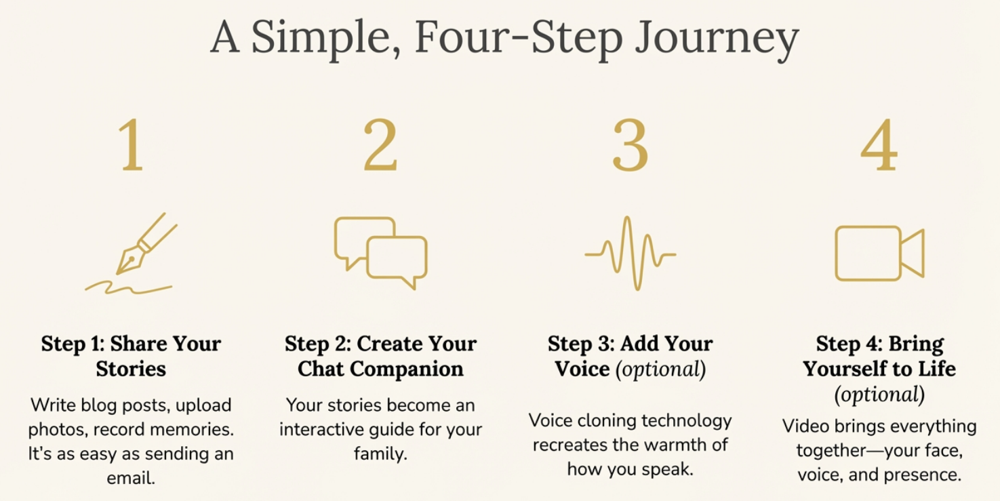

# Process

## Create domain site

Generally, we create a domain for you with you chosen name, (usualy your name like JohnDoe.com).

## Load in plugins

We install all the plugins and features needed.

## Answer questions

With a list of over 200 questions to prompt ideas as well as your own, you create short posts of `POST TITLE` and `POST CONTENT` that are tuned question and answer pairs for better AI retrieval.

You can also add more free flowing content like stories, poems, art etc that can also be used as your public website if you so wish.

## Add media

The site can also be an online phot album with permissions to restrict access to public or user's role.

## Clone Voice

We can clone your voice with [https://elevenlabs.io/](https://elevenlabs.io/) - it only needs 10-20 seconds! This can, if you want, be used to create a conversational chatbot with people asking in text or voice and getting responses in text/voice or both.

## Set up VAPI

[https://vapi.ai/](https://vapi.ai/) is one of many providers that enables you to host your audio chatbot. Your site connect to VAPI which in turn connects to your ElevenLabs voice.

There are many architectures and services one can use.

## Video

[https://www.tavus.io/](https://www.tavus.io/), [https://www.heygen.com/](https://www.heygen.com/) are a few of the many sites that can add vidoe by lipsyncing audio with you own video avatar.

## The future

As time progresses, the quality and range of services will increase, costs will drop, (10x per year seems to be the rate), and having 'a ZOOM conversation with a departed loved one will become everyday.

In fact, as the decades pass, perhaps children will grow up in a culture where DIgital Humans seems as normal as the current generation sees smart phones and social media - how did we ever live without it!

